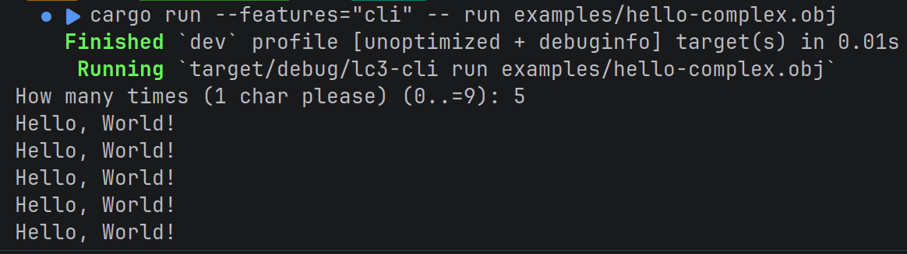

# LC-3-_rs_

An LC-3 virtual machine, implemented in Rust. Most features are implemented with a couple
of exceptions, see [Missing Features](#missing-features).

## Example Usage
```bash
cargo run -r -- run examples/hello2.obj
```

Output of the above program:


## Plans
| Feature         | Info                                |
|-----------------|-------------------------------------|
| Virtual Machine | [Mostly implemented](#instructions) |
| Assembler       | soon™️                              |
| Disassembler    | soon™️                              |
| C Compiler      | soon™️                              |

## References
- https://www.jmeiners.com/lc3-vm/supplies/lc3-isa.pdf (best source)

- https://en.wikipedia.org/wiki/Little_Computer_3 (A little inaccurate, and missing key information)
- https://www.cs.utexas.edu/~fussell/courses/cs310h/lectures/Lecture_10-310h.pdf
- https://acg.cis.upenn.edu/milom/cse240-Fall05/handouts/Ch09-a.pdf


## Instructions
| Instruction | Implemented |
|:-----------:|:-----------:|
|     ADD     |      ✅      |
|     AND     |      ✅      |
|     BR      |      ✅      |
|     JMP     |      ✅      |
|     JSR     |      ✅      |
|    JSRR     |      ✅      |
|     LD      |      ✅      |
|     LDI     |      ✅      |
|     LDR     |      ✅      |
|     LEA     |      ✅      |
|     NOT     |      ✅      |
|     RET     |      ✅      |
|     RTI     |      ❌      |
|     ST      |      ✅      |
|     STI     |      ✅      |
|     STR     |      ✅      |
|    *TRAP    |      ✅      |
| **reserved  |      ❌      |

\* not all standard TRAP vectors are implemented
<br>
** reserved causes an exception when used, which is not implemented yet

# Missing features
- Privileged flag
- Interrupt vector table
- `RTI` instruction
- Supervisor stack & user stack
- `putsp` TRAP vector
- Device register assignments, namely:
  - 0xFE00 Keyboard status
  - 0xFE02 Keyboard data
  - 0xFE04 Display status
  - 0xFE06 Display data
  - 0xFFFE Machine control
- And likely a few more things