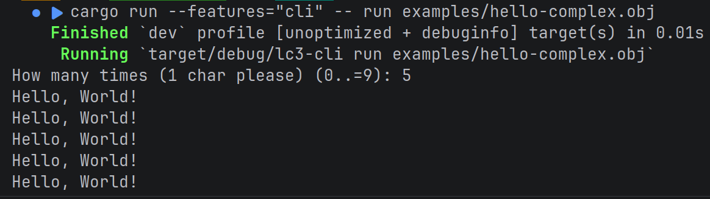

# LC-3-_rs_

An LC-3 virtual machine, implemented in Rust. Most features are implemented with a couple
of exceptions, see [Missing Features](#missing-features).

## Example Usage
```bash
cargo run -r --features="cli" -- run examples/hello2.obj
```

Output of the above program:


## Plans
| Feature         | Info                                |
|-----------------|-------------------------------------|
| Virtual Machine | [Mostly implemented](#instructions) |
| Assembler       | soon™️                              |
| Disassembler    | soon™️                              |
| C Compiler      | soon™️                              |

## References
- Introduction To Computing Systems: From Bits & Gates To C/C++ & Beyond (3rd Edition)
- https://www.jmeiners.com/lc3-vm/supplies/lc3-isa.pdf (pretty good source)

- https://en.wikipedia.org/wiki/Little_Computer_3 (A little inaccurate, and missing key information)

## Virtual Machine
### Instructions
| Instruction | Implemented |
|:-----------:|:-----------:|
|     ADD     |      ✅      |
|     AND     |      ✅      |
|     BR      |      ✅      |
|     JMP     |      ✅      |
|     JSR     |      ✅      |
|    JSRR     |      ✅      |
|     LD      |      ✅      |
|     LDI     |      ✅      |
|     LDR     |      ✅      |
|     LEA     |      ✅      |
|     NOT     |      ✅      |
|     RET     |      ✅      |
|     RTI     |      ✅      |
|     ST      |      ✅      |
|     STI     |      ✅      |
|     STR     |      ✅      |
|    *TRAP    |      ✅      |
| **reserved  |      ✅      |

\* not all standard TRAP vectors are implemented
<br>
** reserved causes an exception when used (which is handled by the OS, and the behavior can be changed by modifying the interrupt vector and/or its implementation)

### Other VM features
| Feature                                          | Status |
|:------------------------------------------------:|:------:|
| Interrupts/Exceptions                            | ✅     |
| *Memory Protection                               | ✅     |
| Memory Device IO Callbacks for external bindings | ✅     |
| Keyboard status and data register                | ✅     |
| Display status and data register                 | ✅     |

* Memory protection relies on how the interrupt is handled. If the default OS is removed, strange behavior may occur if not handled correctly.

# Missing features
- `putsp` TRAP vector
- 0xFFFE Machine control register
- And likely a few more things